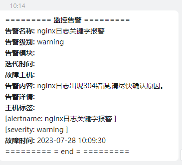

## docker-compose安装

打开URL
https://github.com/docker/compose/releases/

复制下载链接并下载，如下
wget https://github.com/docker/compose/releases/download/1.29.2/docker-compose-Linux-x86_64

移动到bin目录下，并给运行权限
mv docker-compose-Linux-x86_64 /usr/local/bin/docker-compose
chmod +x /usr/local/bin/docker-compose

## 构建prometheus-webhook-dingtalk镜像

参考：https://github.com/timonwong/prometheus-webhook-dingtalk

```shell
下载链接
https://github.com/timonwong/prometheus-webhook-dingtalk/releases

下载并解压
wget https://github.com/timonwong/prometheus-webhook-dingtalk/releases/download/v2.1.0/prometheus-webhook-dingtalk-2.1.0.linux-amd64.tar.gz && tar -zxvf prometheus-webhook-dingtalk-2.1.0.linux-amd64.tar.gz 

重命名
mv prometheus-webhook-dingtalk-2.1.0.linux-amd64 prometheus-webhook-dingtalk/dingtalk

然后构建新的镜像
cd  prometheus-webhook-dingtalk
docker build -t tag_name . 

```

### 钉钉报警截图




### 注意事项

docker-compose.yml文件更新之后，直接重新docker-compose -f monitor-compose.yml up -d即可。
对修改的服务会进行重建，对于没有修改的会输出dingtalk is up-to-date

看如下日志输出：
[root@cdh-master loki]# docker-compose up -d
loki_promtail_1 is up-to-date
dingtalk is up-to-date
loki_grafana_1 is up-to-date
alertmanager is up-to-date
loki_loki_1 is up-to-date